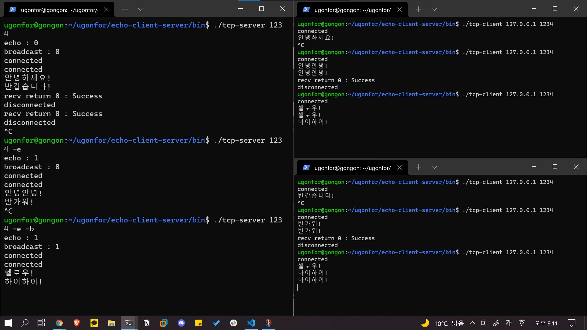

# echo-client-server

> **skeleton code from [gilgil's gitlab code](https://gitlab.com/gilgil/scs)**

* echo client and server
* This use socket interface and make tcp connection between server and client.

## How to use

```sh
make
./tcp-server <port> [-e[-b]]
./tcp-client <ip> <port>
```

## Code
* I use the concept of producer and consumer
* [!]there are little issue
    * if there are no [sleep](https://github.com/ugonfor/echo-client-server/commit/85578521801cfc04abfbe3518388be1e79cc5a68#diff-2aad949905aad62347469dc4f4512368efb6864dab098fece9ea22ad656ebe85R73), server relay doesn't work... I don't know the reason...

## Test



## Code Review comment
* Use lock! need mutex...
* Use wait and signal (for producer and consumer)
* Use smart pointer (On my code, delete doesn't occur with no -e option)
* Use volatile (for msg_queue.empty())
